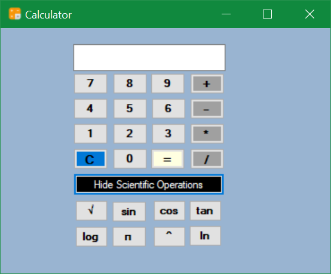

# 🧮 Windows Forms Scientific Calculator

A fully functional scientific calculator built using **C#** and **Windows Forms (.NET Framework)**. This desktop app handles both basic arithmetic and essential scientific operations — with a clean, user-friendly interface.



---

## 🚀 Features

### ✅ Basic Operations
- Addition `+`
- Subtraction `-`
- Multiplication `×`
- Division `÷`

### 🔬 Scientific Operations
- Square Root `√x`
- Sine `sin(x)`
- Cosine `cos(x)`
- Tangent `tan(x)`
- Logarithm `log₁₀(x)`
- Natural Log `ln(x)`
- Pi `π`
- Exponentiation `xʸ`

### 🖱️ UI/UX Highlights
- Interactive buttons for both standard and scientific operations
- Responsive keyboard and mouse support
- Real-time input validation and error handling
- Visually organized layout — no clutter, no chaos

---

## 🛠️ Getting Started

### Prerequisites

Ensure you have the following set up:

- Windows OS
- Visual Studio (with .NET Framework support)

### Installation

1. **Clone the Repository**

   ```bash
   git clone https://github.com/M-Talha-Farooqi/Calculator.git
